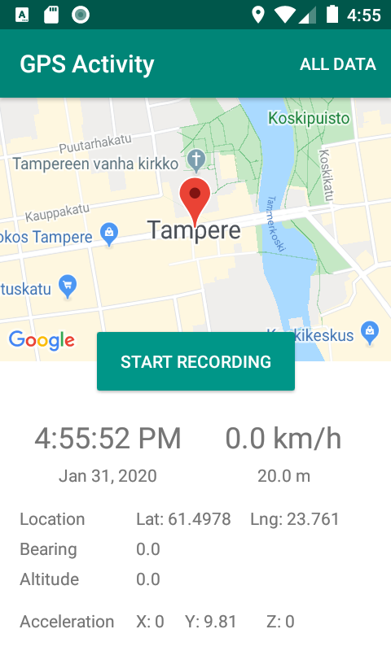

# GPS Activity

The user shall be able to start and stop data recording from the user interface. When recording is started, the following data shall be collected:

- Timestamp 
- GPS
  - position (latitude, longitude) 
  - bearing
  - altitude
  - speed as km/h
  - location accuracy in meters
- Accelerometer
  - x value 
  - y value 
  - z value
  
When the user stops recording the data shall be saved on the device in a csv file. In the file, each row should have all the data values defined above (if data is available) and one row has the data of a given time.
In addition to starting and stopping data recording functionality, the user interface shall show the latest values of the GPS and accelerometer values listed above.

## In result
By tap on the button Start recording each 10 sec current values from sensors are read to CSV file. 
All records are on the second activity.
Each row contains current date and values of sensors separated by comma.

